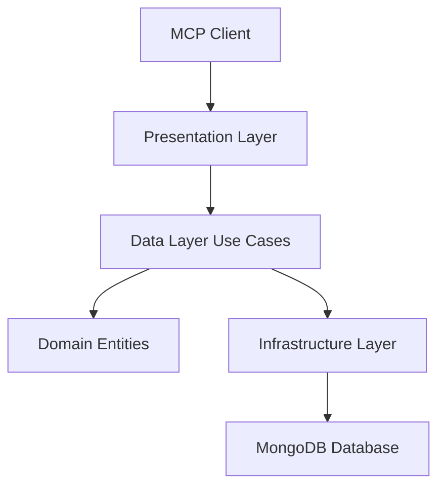

# Source Code Overview

This directory contains the complete source code for the Memory Bank MCP MongoDB server, organized following Clean Architecture principles.

## 🏗️ Architecture

The codebase follows **Clean Architecture** with clear separation of concerns:

```
src/
├── domain/          # 🎯 Core business logic (entities & use cases)
├── data/            # 📊 Data access layer (repositories & implementations)
├── presentation/    # 🌐 API layer (controllers & HTTP handling)
├── infra/           # 🔧 Infrastructure (database, external services)
├── main/            # 🚀 Application entry point & dependency injection
└── validators/      # ✅ Input validation & security
```

## 📁 Layer Details

### [Domain Layer](domain/README.md)
- **Purpose**: Core business entities and use case interfaces
- **Contains**: Entities (File, Project, etc.), business rules
- **Dependencies**: None (pure business logic)

### [Data Layer](data/README.md)
- **Purpose**: Data access and persistence logic
- **Contains**: Repository implementations, use case implementations
- **Dependencies**: Domain layer only

### [Presentation Layer](presentation/README.md)
- **Purpose**: API endpoints and request/response handling
- **Contains**: MCP controllers, HTTP helpers, error handling
- **Dependencies**: Domain and data layers

### [Infrastructure Layer](infra/README.md)
- **Purpose**: External concerns (database, file system)
- **Contains**: MongoDB adapters, storage implementations
- **Dependencies**: All layers (outermost layer)

### [Main Layer](main/)
- **Purpose**: Application bootstrap and dependency injection
- **Contains**: Configuration, factories, protocol setup
- **Dependencies**: All layers (composition root)

### [Validators](validators/)
- **Purpose**: Input validation and security checks
- **Contains**: Validation schemas, security validators
- **Dependencies**: Domain layer for entity validation

## 🔄 Data Flow



## 🎯 Key Principles

### 1. **Dependency Inversion**
- Inner layers don't depend on outer layers
- Dependencies point inward toward the domain

### 2. **Single Responsibility**
- Each module has one reason to change
- Clear separation between business logic and infrastructure

### 3. **Interface Segregation**
- Small, focused interfaces
- Protocols defined in the layer that uses them

### 4. **Open/Closed Principle**
- Open for extension, closed for modification
- New features added without changing existing code

## 🚀 Getting Started

1. **Understand the Domain**: Start with [`domain/README.md`](domain/README.md)
2. **Explore Use Cases**: Check [`data/README.md`](data/README.md)
3. **See API Endpoints**: Review [`presentation/README.md`](presentation/README.md)
4. **Database Setup**: Read [`infra/README.md`](infra/README.md)

## 📚 Related Documentation

- **[Main README](../README.md)** - Project overview and setup
- **[Testing Guide](../tests/README.md)** - How to write and run tests
- **[Feature Guide](../FEATURE_GUIDE.md)** - Detailed feature documentation

---

*This architecture ensures maintainability, testability, and clear separation of concerns for the Memory Bank MCP server.*
